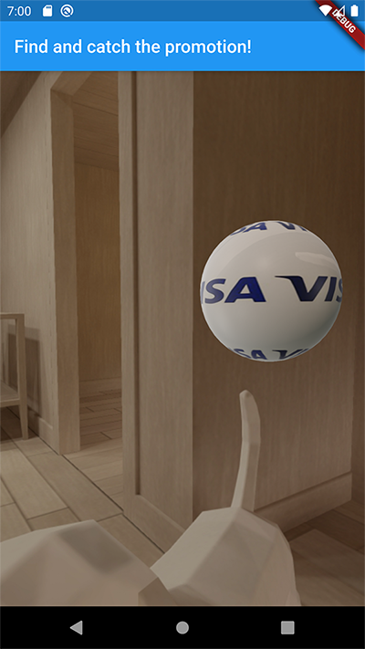

# PromoGo

PromoGo allows Small Business Merchants to promote their stores to potential customers through targeted promotions and an addictive promotion capture process. 

Inspired by the viral hit Pokemon Go, users go around capturing promotions for promo codes with the AR feature in PromoGo. This gamification component attracts users to use the app and spend more at stores using their newly captured promo codes. 

PromoGo was developed as part of the Visa Virtual Hackathon during the Visa Summer Internship programme 2020.

## Visa APIs used

We have used the Visa Merchant Locator API to locate participating merchants, as well as the Visa Direct API for seamless in-app purchases.

## Third Party Software

PromoGo uses Firebase for authentication and the Google Maps API to augment the Visa Merchant Locator API.

## Screenshots

